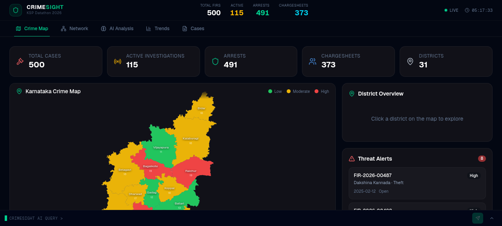
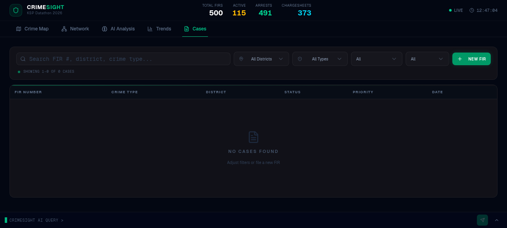
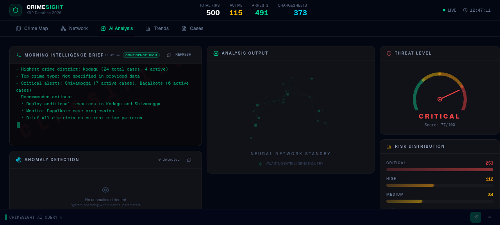
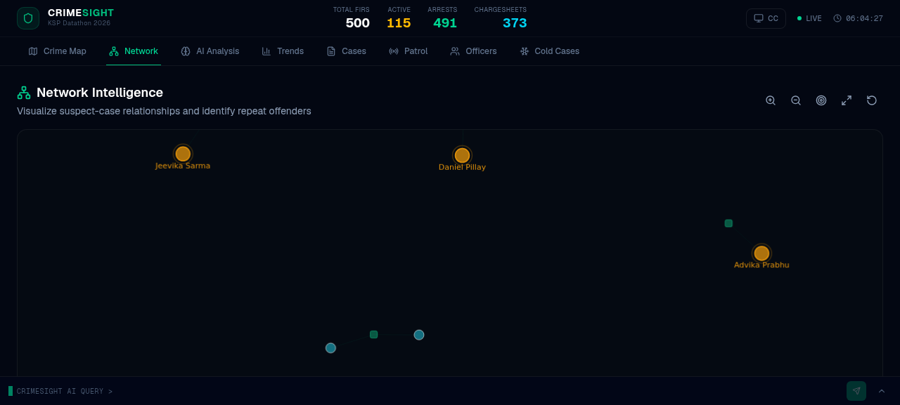

# CrimeSight AI

> Evidence-backed FIR intelligence for Karnataka State Police — a reproducible synthetic prototype built by **Team Quantara** for **KSP Datathon 2026**.

[](https://crimesight-dep-onmoxbpk.onslate.in/)

**Team lead:** Gurukiran KM<br>
**Live deployment:** [crimesight-dep-onmoxbpk.onslate.in](https://crimesight-dep-onmoxbpk.onslate.in/)

## Problem addressed

Police teams need to move quickly between FIRs, districts, offence types, case status, risk signals, and related entities. Conventional dashboards make this navigation slow, while generic AI can give an answer without showing the evidence behind it.

CrimeSight AI makes FIR intelligence **verifiable before action**. It supports officers with transparent, evidence-backed review workflows; it never makes enforcement decisions.

> **Data boundary:** All records in this prototype are deterministic synthetic FIR data, modelled on the supplied KSP ER schema. This prototype is not connected to live operational police data.

## Working prototype

### Demo access

The login screen is a visual demonstration gate only — it is **not** real authentication.

| Field | Value |
| --- | --- |
| Officer ID / Username | `admin` |
| Access code | `admin` |

### Core workflow

1. Open **Geo Intel** to see district-level crime volume, risk, and offence signals.
2. Open **FIR Registry** to search, filter, and expand a reproducible FIR record.
3. Inspect **Network** to understand linked case context across people, officers, locations, and evidence.
4. Ask **CrimeSight AI** a verified FIR question, for example: `Show high-risk cybercrime FIRs in Mysuru`.
5. Inspect the **Proof Before Action** receipt: visible filters, matching records, query ID, and source coverage.
6. Open **Actions** to approve a review, request evidence, or defer — all while keeping a visible audit trail.

## Key features

| Feature | What it does |
| --- | --- |
| **Geo Intel** | District crime choropleth with FIR volume, active investigations, high-priority signals, and offence classification. |
| **FIR Registry** | Search and filter 10,000+ reproducible FIR records by FIR number, crime type, district, status, and priority. |
| **Connected Network** | Brings FIR context together across related people, officers, locations, and evidence. |
| **Verified Query Copilot** | Converts supported natural-language FIR questions into allow-listed filters; it does not generate or run unrestricted SQL. |
| **Proof Before Action** | Displays matching records, query ID, applied filters, source coverage, and the synthetic-data boundary before review. |
| **Governed Actions** | Lets a human officer approve review, request evidence, or defer, with an auditable decision history. |
| **Judge Story** | A guided end-to-end demonstration from verified signal to accountable human action. |
| **Field FIR intake** | Demonstrates field-report capture and Catalyst-backed persistence readiness. |

## Product screens

| Geo intelligence | FIR registry |
| --- | --- |
|  |  |

| Verified AI query | Connected investigation context |
| --- | --- |
|  |  |

## Technology stack

| Capability | Implementation |
| --- | --- |
| Web application | Next.js, TypeScript, React, Tailwind CSS |
| Deployment | **Zoho Catalyst Slate** |
| Backend workflow readiness | Catalyst Functions / Advanced I/O, Data Store, Stratus-ready evidence flow |
| Reproducible data | 10,000+ deterministic synthetic FIR records modelled on the supplied KSP ER schema |
| Governed review | Catalyst-backed review path with a safe local synthetic fallback for reliable demonstrations |
| Ontology readiness | Palantir Foundry `FIR Case` model linked to Person, Officer, Location, and Evidence objects |
| AI safety | Allow-listed FIR filters and verified deterministic query execution |

## Query Copilot safety model

CrimeSight’s conversational layer is deliberately constrained:

- It accepts FIR and crime-intelligence questions within the demonstrated scope.
- It translates supported questions into allow-listed district, crime, priority, status, repeat-pattern, and time filters.
- It returns a query ID, applied filters, result count, highest-risk matching FIRs, and a data-boundary notice.
- It asks for clarification when a question is ambiguous or out of scope.
- It never creates unrestricted SQL, fabricates records, exposes real operational data, or performs automated enforcement.

Read the full [architecture](docs/ARCHITECTURE.md) and [Judge Story walkthrough](docs/JUDGE_DEMO.md).

## Run locally

### Prerequisites

- Node.js 22 or later
- npm

### Setup

```bash
git clone https://github.com/gurukirankm066/crimesight-dep.git
cd crimesight-dep
cp .env.example .env
npm install
npm run setup
npm run dev
```

Open [http://localhost:3000](http://localhost:3000), then use `admin` / `admin` for the demonstration gate.

### Validate a production build

```bash
npm run build
```

## Optional integrations

- **Zoho QuickML** provides optional normal conversation through a private Catalyst Function; verified FIR questions remain deterministic and evidence-backed. See [QuickML setup](docs/QUICKML_SETUP.md).
- **Palantir Foundry** provides ontology readiness for linked FIR case context. Public demo availability does not depend on external connector uptime; it safely falls back to synthetic data.

## Demo video

**Final walkthrough video:** _Add the public Google Drive or unlisted YouTube URL here before submission._

The video should demonstrate, in order: Geo Intel → FIR Registry → Network → verified AI query and proof → human review and audit trail.

## Safety and responsible use

- Synthetic, reproducible prototype data only.
- No live police records or personally identifying data.
- No automated enforcement or automated adverse decisions.
- Human officers remain accountable for every review decision.
- Connector and data-source status is visible in the application.

---

Built by **Team Quantara** · **KSP Datathon 2026** · [Open the live prototype](https://crimesight-dep-onmoxbpk.onslate.in/)
