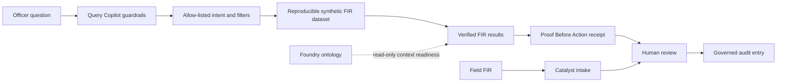

# CrimeSight Architecture

## Purpose

CrimeSight turns a natural-language FIR question into a reviewable, evidence-backed result. It is intentionally designed so a user can understand what was queried before acting on it.

## Query Copilot boundary

The query layer is a controlled parser, not free-form SQL generation.

| Stage | Control |
| --- | --- |
| Natural-language question | accepted only for FIR and crime-intelligence scope |
| Intent parsing | allow-listed district, crime, priority, status, repeat-pattern, and time filters |
| Dataset execution | deterministic synthetic FIR dataset |
| Response | result count, filters, top matching FIRs, query ID, and data boundary |
| Ambiguity | clarification requested instead of inventing an interpretation |

## Platform integration

- **Zoho Catalyst Slate** hosts the Next.js interface.
- **Catalyst Advanced I/O + Data Store** support field FIR intake and governed review persistence.
- **Catalyst Stratus** is the evidence-object storage path.
- **Palantir Foundry** provides an ontology-ready FIR Case model with linked Person, Officer, Location, and Evidence objects.

The public prototype uses synthetic fallback data so that a transient connector or external platform issue does not break the judge demo.
